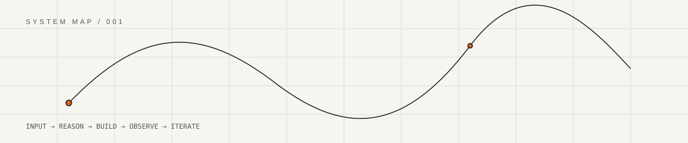
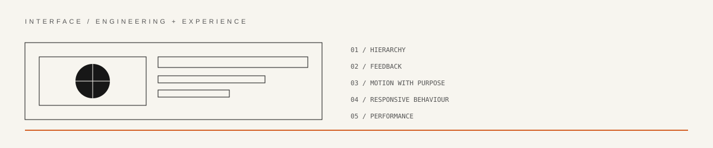
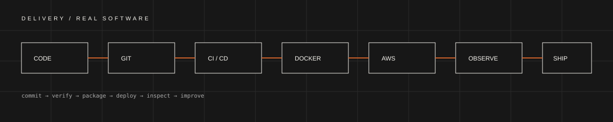

<div align="center">

</div>

<br/>

<div align="center">
<code>AI SYSTEMS</code> &nbsp;·&nbsp; <code>SOFTWARE</code> &nbsp;·&nbsp; <code>CREATIVE ENGINEERING</code> &nbsp;·&nbsp; <code>SYSTEMS</code>
</div>

<br/>

<div align="center">

</div>

## / 00 — THE SHORT VERSION

I'm **Aniket Pandey** — a builder working at the intersection of **AI, software, automation and visual experience**.

I like systems that are technically serious but don't feel lifeless.

That means I care about the model, the architecture, the interface, the interaction, the deployment — and the tiny moment where someone uses the thing and thinks **"yeah, this feels considered."**

I'm not interested in pretending one title explains everything I do.

**I build. I experiment. I break things. I understand them. Then I make them better.**

---

## / 01 — ENGINEERING, BUT WITH A POINT OF VIEW

<table>
<tr><td width="50%">

**INTELLIGENCE**  
LLMs · GenAI · agents · tool use · AI-assisted development · automation

</td><td width="50%">

**SOFTWARE**  
TypeScript · JavaScript · React · Vite · Node.js · APIs · MongoDB

</td></tr>
<tr><td>

**SYSTEMS**  
Docker · AWS · Linux · GitHub Actions · Jenkins · CI/CD · Kubernetes

</td><td>

**EXPERIENCE**  
GSAP · Framer Motion · Tailwind · interactive interfaces · digital experiences

</td></tr>
</table>

The interesting work usually happens **between** those categories.

<div align="center">

</div>

---

## / 02 — THE TOOLBOX

<div align="center">

`ChatGPT` `Claude` `Gemini` `Cursor` `Trae` `Krea` `Stitch`

`TypeScript` `JavaScript` `React` `Vite` `Node.js` `Express` `MongoDB`

`GSAP` `Framer Motion` `Tailwind CSS` `Swiper` `Figma`

`Docker` `AWS` `Git` `GitHub Actions` `Jenkins` `Linux` `Kubernetes`

</div>

I don't collect technologies for the sake of collecting them.  
I reach for whatever lets me **think, prototype, test or ship faster**.

---

## / 03 — THINGS I'VE ACTUALLY BUILT

<table>
<tr><td width="50%">

### AI RECRUITER INTELLIGENCE SYSTEM

A GenAI hiring workflow that parses candidate information, evaluates skills against a role, checks for suspicious claims, produces a hiring decision and generates role-specific interview questions.

`REACT` `NODE` `EXPRESS` `OPENROUTER` `MULTI-AGENT`

<a href="https://github.com/Aniket28-4L/AI-Recruiter-Intelligence-System-GenAI-SaaS-">VIEW SYSTEM →</a>

</td><td width="50%">

### AI OPS COPILOT

A multi-agent workflow built around intent detection, task planning, execution and memory — turning natural-language requests into structured business actions.

`REACT` `NODE` `EXPRESS` `LLM APIs` `MEMORY`

<a href="https://github.com/Aniket28-4L/AI-Ops-Copilot">VIEW SYSTEM →</a>

</td></tr>
<tr><td>

### AG MAKEUP STUDIO

A cinematic client-facing web experience combining motion, video, CMS architecture, responsive engineering and art direction.

`REACT` `SANITY` `GSAP` `MOTION`

<a href="https://github.com/Aniket28-4L/AGMAKESTUDIO">VIEW BUILD →</a>

</td><td>

### GEN-AI PORTFOLIO

An ongoing experiment in AI-assisted development and highly intentional digital experience design.

`REACT` `TYPESCRIPT` `AI`

<a href="https://github.com/Aniket28-4L/Gen-AI-Portfolio">VIEW BUILD →</a>

</td></tr>
</table>

The point of these projects isn't that they contain AI.  
It's that they explore **what happens when AI becomes part of an actual software system.**

---

## / 04 — AI, WITHOUT THE THEATRE

**AI is leverage. It isn't the thinking.**

I use models to explore, prototype, debug, research, generate and accelerate — but I want to understand the system underneath the output.

When I build an AI workflow, I care about:

- what the model is actually responsible for
- where deterministic software makes more sense
- what information the system needs at each step
- whether outputs can be validated and inspected
- what happens when the happy path disappears

The goal isn't **"add AI."**

The goal is **better systems.**

<div align="center">

</div>

---

## / 05 — AI MEETS THE SCREEN

A technically correct product can still feel unfinished.

I enjoy the other layer: **hierarchy, pacing, motion, typography, composition, transitions, feedback and restraint.**

Motion should communicate state.  
Animation should have a reason.  
Visual polish should survive without gimmicks.

I'm especially interested in interfaces that feel **engineered rather than decorated**.

<div align="center">

</div>

---

## / 06 — HOW THINGS ACTUALLY SHIP

<div align="center">

</div>

The part of software I enjoy just as much as building the feature is figuring out **why it broke in production**.

Git → CI/CD → containers → cloud → deployment → observation → iteration.

---

## / 07 — EXPERIMENT LOG

```text
047 / Can an AI agent remove the boring part?
046 / How much motion is too much?
045 / Can a CMS disappear completely into the experience?
044 / What happens when AI enters the development loop?
043 / Why can a simpler interface feel more sophisticated?
042 / Can automation solve the problem before software has to?
041 / What makes an interaction feel inevitable instead of flashy?
040 / Where should an AI system stop and deterministic code begin?
```

**The experiments change. The curiosity doesn't.**

---

## / 08 — BUILD PHILOSOPHY

| PRINCIPLE | WHAT IT MEANS |
|---|---|
| **01 / START WITH THE PROBLEM** | Don't begin with a framework because it is fashionable. |
| **02 / MAKE THE FIRST VERSION FAST** | Working software creates better questions than perfect plans. |
| **03 / KEEP THE SYSTEM LEGIBLE** | If I can't explain what is happening, I probably haven't finished building it. |
| **04 / DESIGN IS PART OF ENGINEERING** | A product's behaviour and appearance are both part of the experience. |
| **05 / STRESS THE HAPPY PATH** | Break things deliberately. Surprises teach quickly. |
| **06 / SHIP THE LEARNING** | Every build should leave behind something I understand better. |

<div align="center">

</div>

---

## / 09 — THE DISTRACTION LOOP

```text
build something
      ↓
find a new model / API / idea
      ↓
"could this automate it?"
      ↓
prototype it
      ↓
break it
      ↓
understand why
      ↓
accidentally build a second thing
      ↓
repeat
```

This is less of a productivity problem than it sounds.

Most of my useful work has started with **"I wonder if..."**

---

## / 10 — CURRENT STATE

<div align="center">

`BUILDING █████████░` &nbsp;&nbsp; `EXPERIMENTING ██████████`  
`LEARNING ██████████` &nbsp;&nbsp; `SHIPPING ████████░░`

<br/><br/>

**CURRENT VECTOR**  
AI × Software × Automation × Creative Technology

**OPERATING PRINCIPLE**  
<em>Don't pretend to know everything. Learn fast enough to build anyway.</em>

</div>

---

## / 11 — OUTSIDE THE CODE

I also work on **client websites, digital experiences, branding and marketing-oriented projects**.

The same principle applies: understand the actual problem, then make the result feel intentional.

No unnecessary complexity.  
No decorative technology.  
No "AI" pasted onto things that don't need it.

---

## / 12 — SIGNALS

<div align="center">

<a href="https://github.com/Aniket28-4L?tab=repositories">REPOSITORIES</a> &nbsp; · &nbsp; <a href="https://github.com/Aniket28-4L">GITHUB</a>

<br/><br/>

<sub>ANIKET PANDEY / AI + SOFTWARE + CREATIVE ENGINEERING</sub>

<br/>

<code>observe → question → construct → stress-test → refine → ship</code>

</div>
