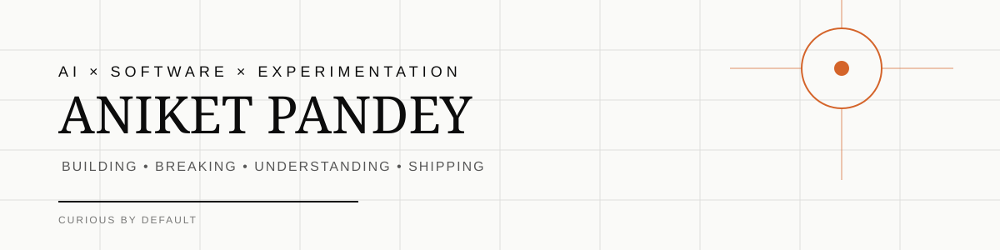
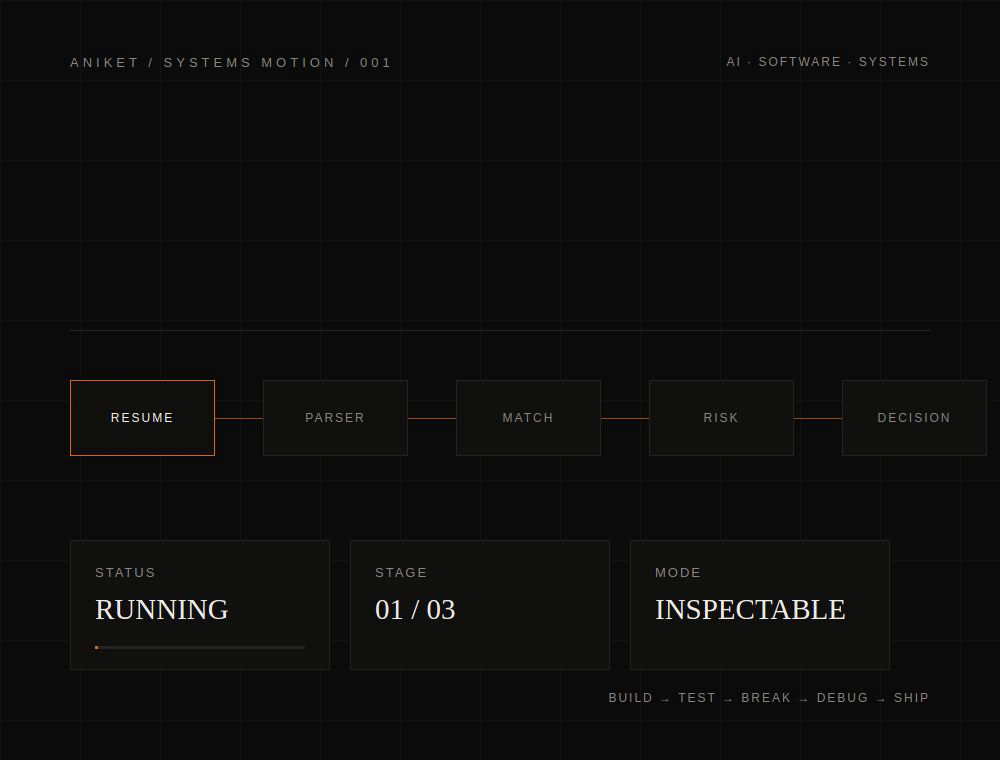
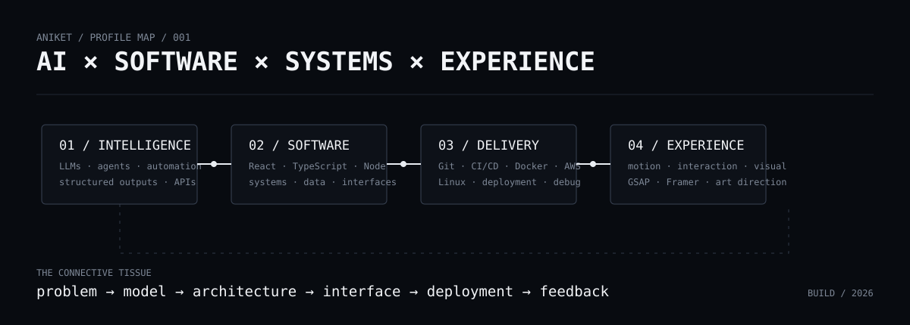
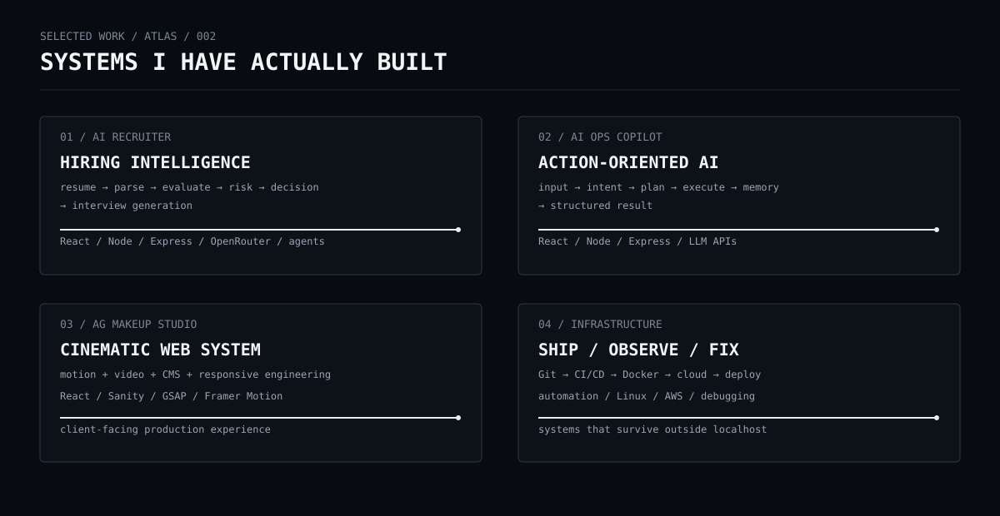
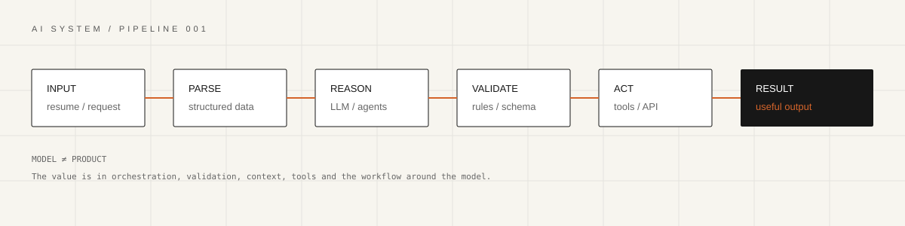
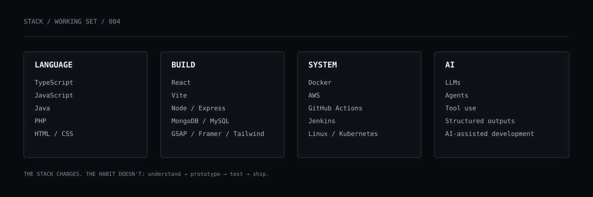
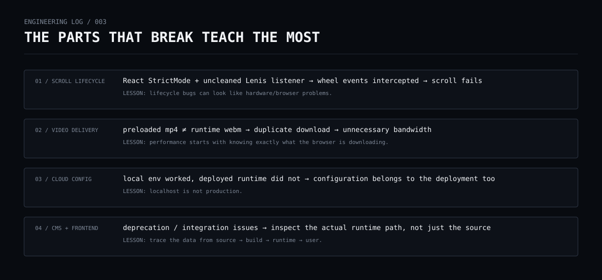
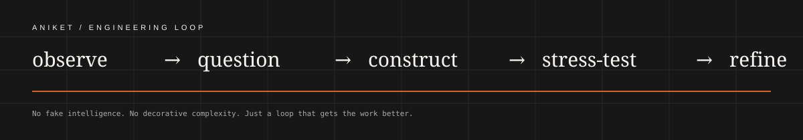

<div align="center">

</div>

<div align="center">

</div>

<div align="center">

`AI` &nbsp; `SOFTWARE` &nbsp; `SYSTEMS` &nbsp; `CREATIVE TECHNOLOGY`

**I build things at the point where intelligent software, engineering systems and digital experience meet.**

<a href="https://github.com/Aniket28-4L?tab=repositories">REPOSITORIES</a> · <a href="https://github.com/Aniket28-4L">GITHUB</a>

</div>

<br/>

<div align="center">

</div>

<br/>

## 01 / WHAT I WORK ON

I don't really fit into one clean category.

I build **AI workflows, full-stack software, automation, deployment systems and highly intentional interfaces**. The interesting part is usually the connection between them.

```text
problem
   ↓
understand the system
   ↓
prototype quickly
   ↓
make the behaviour inspectable
   ↓
build the interface
   ↓
ship it
   ↓
find what breaks
   ↓
fix what actually matters
```

<br/>

<div align="center">

</div>

<br/>

## 02 / THE AI LAYER

I use AI as part of software systems — **not as a substitute for understanding them.**

The work I care about is where a model has a defined job inside a larger architecture:

| LAYER | QUESTION |
|---|---|
| **MODEL** | What is the model actually good at? |
| **CONTEXT** | What information does it need? |
| **ORCHESTRATION** | What should happen before and after the model? |
| **TOOLS** | What can the system actually do? |
| **VALIDATION** | How do we know the result is usable? |
| **MEMORY** | What should persist between interactions? |
| **FAILURE** | What happens when the model is wrong? |

### A few real experiments

- **AI Recruiter Intelligence System** — multi-stage candidate analysis, structured outputs, risk detection and interview generation.
- **AI Ops Copilot** — intent → planning → execution → memory → structured result.
- **AI-assisted development** — using models to explore, debug, prototype and accelerate implementation while keeping the underlying system understandable.

<div align="center">

</div>

<br/>

## 03 / ENGINEERING SIGNAL

The stack is a means to an end.

<div align="center">

</div>

I move between frontend, backend, AI integration and infrastructure depending on what the problem requires.

**Frontend** → React · TypeScript · Vite · Tailwind · GSAP · Framer Motion  
**Backend** → Node.js · Express · APIs · MongoDB · MySQL  
**Infrastructure** → Docker · AWS · Linux · GitHub Actions · Jenkins · CI/CD · Kubernetes  
**AI** → LLM APIs · agents · structured outputs · prompt engineering · automation

<br/>

## 04 / THINGS I LEARNED BY BREAKING THEM

<div align="center">

</div>

Some of the most useful engineering lessons came from bugs that looked completely unrelated to their real cause.

- A scroll problem turned out to be a **lifecycle / event-listener problem**.
- A performance problem started with **two different video formats being downloaded**.
- A deployment worked locally but failed because **production configuration is part of the application**.
- A CMS integration issue required tracing the entire path from **source → build → runtime**.

I like debugging because the answer usually teaches more than the bug itself.

<br/>

## 05 / SELECTED BUILDS

### `AI-RECRUITER-INTELLIGENCE-SYSTEM`
GenAI hiring workflow with candidate parsing, skill evaluation, suspicious-profile detection, hiring decisions and interview generation.

`REACT` `NODE` `EXPRESS` `OPENROUTER` `MULTI-AGENT`

<a href="https://github.com/Aniket28-4L/AI-Recruiter-Intelligence-System-GenAI-SaaS-">VIEW REPOSITORY →</a>

---

### `AI-OPS-COPILOT`
An action-oriented AI system built around intent detection, planning, execution agents and memory.

`REACT` `NODE` `EXPRESS` `LLM APIs` `MEMORY`

<a href="https://github.com/Aniket28-4L/AI-Ops-Copilot">VIEW REPOSITORY →</a>

---

### `AGMAKESTUDIO`
A production client website combining motion, video, CMS architecture, responsive engineering and visual direction.

`REACT` `SANITY` `GSAP` `FRAMER MOTION`

<a href="https://github.com/Aniket28-4L/AGMAKESTUDIO">VIEW REPOSITORY →</a>

---

### `GEN-AI-PORTFOLIO`
An ongoing experiment around AI-assisted development and digital experience design.

`REACT` `TYPESCRIPT` `AI`

<a href="https://github.com/Aniket28-4L/Gen-AI-Portfolio">VIEW REPOSITORY →</a>

<br/>

## 06 / CURRENT EXPERIMENTS

```text
[ BUILD ]     AI systems that do more than chat
[ EXPLORE ]   agent workflows + tool use
[ IMPROVE ]   full-stack architecture
[ STUDY ]     deployment + infrastructure
[ DESIGN ]    interfaces where motion has a job
[ QUESTION ]  where should AI stop and deterministic code begin?
```

<br/>

## 07 / HOW I THINK ABOUT BUILDING

| PRINCIPLE | PRACTICE |
|---|---|
| **START WITH THE PROBLEM** | Technology follows the problem, not the other way around. |
| **BUILD THE FIRST VERSION** | Working software creates better questions. |
| **KEEP IT LEGIBLE** | If I can't explain the system, I haven't understood it enough. |
| **USE AI WITH INTENT** | Give models a defined role instead of sprinkling AI everywhere. |
| **DESIGN IS ENGINEERING** | Behaviour, hierarchy and interaction are part of the product. |
| **BREAK THE HAPPY PATH** | Failure is a faster teacher than a perfect demo. |
| **SHIP THE LEARNING** | Every project should leave me knowing something I didn't know before. |

<br/>

## 08 / THE LOOP

<div align="center">

</div>

<br/>

<div align="center">

### BUILD · TEST · BREAK · DEBUG · SHIP

`AI` · `SOFTWARE` · `SYSTEMS` · `EXPERIMENTS`

<br/>

<sub>ANIKET PANDEY / BUILDING IN PUBLIC, LEARNING IN THE PROCESS</sub>

</div>
